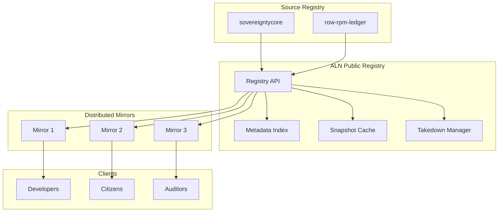

# ALN Public Registry Architecture

## Overview

`aln-public-registry` is the **Public Access Layer** of the Sovereign Spine, providing a transparent, distributed registry of approved Sourzes and DOW artifacts with mirror synchronization.

## Architecture Diagram



## Key Design Principles

1. **Public Transparency** - All artifact metadata publicly accessible
2. **Distributed Resilience** - Multiple mirrors prevent single-point failure
3. **Offline Verification** - Pinned snapshots for air-gapped use
4. **Takedown Capability** - Compromised artifacts can be revoked
5. **No Private Keys** - Only public metadata distributed

## API Endpoints

| Endpoint | Method | Description |
|----------|--------|-------------|
| `/api/v1/search` | POST | Search artifacts |
| `/api/v1/sourzes/{id}` | GET | Get Sourze |
| `/api/v1/dows/{id}` | GET | Get DOW |
| `/api/v1/verify` | POST | Verify artifact |
| `/api/v1/snapshots` | GET | List snapshots |
| `/api/v1/takedown` | POST | Report takedown |
| `/api/v1/mirrors` | GET | List mirrors |

## Security Properties

- **Public Metadata** - All metadata publicly auditable
- **Private Keys Protected** - Only public keys distributed
- **Mirror Resilience** - Multiple mirrors prevent censorship
- **Takedown Protocol** - Compromised artifacts can be revoked
- **Offline Verification** - Pinned snapshots enable air-gapped use

## Mirror Types

| Type | Protocol | Purpose |
|------|----------|---------|
| Primary | HTTPS | Official source |
| Secondary | IPFS | Decentralized |
| Tertiary | Torrent | High-bandwidth |
| Offline | Local | Air-gapped |

---

**Document Hex-Stamp:** `0x9c0d1e2f3a4b5c6d7e8f9a0b1c2d3e4f5a6b7c8d9e0f1a2b3c4d5e6f7a8b9c0d`  
**Last Updated:** 2026-03-04
```
